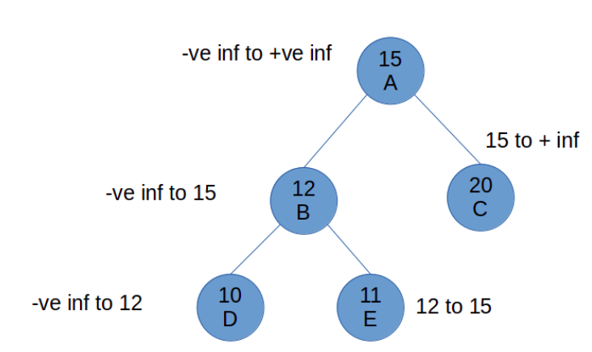
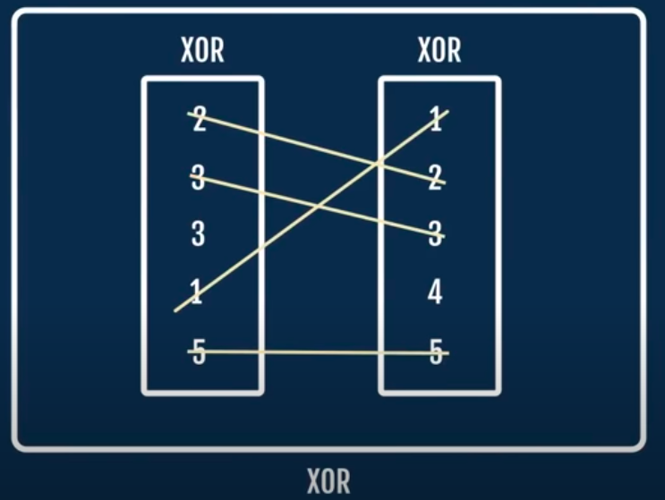

<div align='center'>

<h2>Technical Interview Questions Practice</h2>

</div>


## check if a bst is bst

write a function which will take root node pointer and return a bool, true if bst is bst, else false

In order to be a binary tree, a tree must follows the properties of binary search tree:

All the nodes in the left of the root node must be less than the root. (or equal, if handling duplicates)
All the nodes in the right of the root node must be greater than the root node.
A Brute force approach can be to check each element in the left and right subtree to see if they follows the properties of bst. But The left and right subtrees must also be binary subtrees.

A better approach would be, define a range in which node (node’s data) must be present to satisfy the condition of binary search tree.

For root node, The range would be -ve infinity to +ve infinity.
For other nodes in the tree, we can define upper and lower bound based on their root’s value.
Example:



In the above representation, the root node can have values between -ve infinity and +ve infinity, but as we go down the tree, these ranges are resets according to the values of their respective nodes.

For node E 12 is the value of its parent, so it cant have value less than that as it is in right subtree of the root, And it cant have value more than 15 as it is in left side of the root node of the tree.

sudo code:

```
isBST(root, minVal, maxVal)
    base case : if root == null then return true;
    
    if root.data > minVal and 
         root.data < maxVal and
         
         // for left subtree, lower bound will be same whereas upper bound will be the data in the current root node :
         isBST(root.left, minVal, root.data)
         
         // for right subtree, lower bound will be the data in the root and upper bound will be the same:
         isBST(root.right, root.data, maxVal)
         
              return true;
        else:
                return false;

```

C++ code:

```cpp
bool checkBinSearchTree(Node *root, int minV, int maxV) {
    if (root == nullptr) return true;
    if (root->data > minV && root->data < maxV &&
        checkBinSearchTree(root->left, minV, root->data) &&
        checkBinSearchTree(root->right, root->data, maxV)
            )
        return true;
    else return false;
}

bool isBinary(Node *root) {
    return checkBinSearchTree(root, INT_MIN, INT_MAX);
}

```

## Clone a doubly linked list with next and random pointer:

- Given linked list
    
    
- create new node while iterating through the original linked list for each original node. Connect the next of original node to newly created node and connect the newly created node to next of the original node.
    
    
- Now to connect the random pointers, iterate through the list and connect the random pointer of new node to next of the random node of original node.
    
    
- At last reset the original links of original list and newly created list. To do this run a while loop iterating through the list and:
    
    - point the next of original to next of next of original.
    - point the next of copy to next of next of copy
- This will be final result:
    
    

C++ code:

```cpp
Node *cloneLinkedList() {
        Node *current = head;
        Node *temp;

        while (current) {
            temp = current->nextPointer;
            current->nextPointer = getNode(current->data);
            current->nextPointer->nextPointer = temp;
            current = temp;
        }

        current = head;
        while (current) {
            current->nextPointer->randPointer = current->randPointer ?
                                                current->randPointer->nextPointer : current->randPointer;
            current = current->nextPointer->nextPointer;
        }

        Node *original = head;
        Node *copy = head->nextPointer;
        temp = copy;
        while (original && copy) {
            original->nextPointer = original->nextPointer->nextPointer;
            copy->nextPointer = copy->nextPointer ? copy->nextPointer->nextPointer : copy->nextPointer;

            original = original->nextPointer;
            copy = copy->nextPointer;
        }
        return temp;
    }
```

## Connect nodes at the same level in Binary tree:

For a given root node of a binary tee, connect the nodes at same level like this :


### Method 1: Using Preorder traversal

sudo code:

```
connectNodes(root)
    if root is null, then return;
    
    else {
    
        set the nextRight node for root node:
            root.nextRight = NULL;  // as right of root will be always null
            
        Run a while loop to set nextRight of all nodes level by level:
            
            while root is not null{
                Store root in a variable to set nextRight of its children:
                    temp = root;
                    
                Run a while loop untill temp is not null to connect all the Children nodes of 
                root and children node of all other node at same level:
                
                while temp is not null{
                    check if temp has left child:
                    
                    if temp.left:
                    
                        If temp has right child, then right child is nextRight
                        of temp.
                        
                        if temp.right:
                            
                            temp.left.nextRight = temp.right;
                        
                        else:
                            Otherwise call a function getNextRight to get next right
                            
                            temp.left.nextRight = getNextRight(temp);
                        
                        We also have to set nextRight of right child using the function getNextRight():
                        if temp.right:
                            temp.right.nextRight = getNextRight(temp);
                        
                        Set nextRight for othre in preorder fashon:
                        temp = temp.nextRight;
                }
                
                Start from the first node of next level:
                if root.left:
                    root = root.left
                
                else if root.right:
                    root = root,right
                
                else
                    root = getNextNode(root);
            }
    }
        
```

getNextright() function’s algorithm is:

```
getNextRight(node):
    for a given node, check if it has nextRight node:
        
        temp = node.nextRightNode;
        
        now run a while loop untill temp is null and check if its children has the nextRight nnode:
            
            while temp is not null:
                if temp has left child:
                    return temp.left
                
                if temp has right child:
                    return temp.right
                
                temp = temp.nextRight
            
            return null;
    
```

## Find height of binary tree

> Height of a tree is defined as the number of edges in longest path from root to leaf node.
> Height of a node is defined as the number of edges in longest path from that node to deepest leaf node.


Algorithm

```
find_height(root)
    For any node, 
    
    if root == null:
        retutrn - 1;
    
    1. Calculate the height of its left subtree.
    2. Height of its right subtree.
    
    Then the height of that node would be MAX(height of left, height of right) + 1.
    
    +1 is for the edge connecting the subtree to root node.

```

**Note that** we are returning `-1` from the base case, this is because we are doing a +1 in the function where heigh is `max(height of left subtree, height of right subtree) + 1`.


If we simply return 0 from the base case the the height of the leaf node will be 1, which is incorrect.

```cpp
int findHeight(node* root){
    if (root==nullptr) return -1;
    
    int heightOfLeft = findHeight(root->left);
    int heightOfRight = findHeight(root->right);
    
    retutn max(heightOfLeft, heightOfRight) + 1;
}

```

**Height of an empty tree is -1**

**Complexity analysis:** Time complexity will be `O(n)` as we are visiting every node.

## Balance height of binary tree

The tree is balance if, for each node , the difference between the left subtree and right subtree is <=1

> leaf nodes are always balanced with height 0.

We can calculate height in two ways:

1.  Calculate the height of the left subtree and right subtree and then check if their absolute difference is <= 1.
    1.  This will take O(nxn) or O(n^2) calls. `n` calls for calculating height and `n` calls to compare the difference for each node.
2.  Calculate the height and difference in one pass of recurrsion.
    1.  This will reduce the calls by O(n), that means it will take only O(n) calls to compute the height and compare the difference.
    2.  To achive this, we need to pass an integer pointer in the function `height`.

Algorithm:

```
isBalanced(root, int* height)

    for a given node and height:
    
    if root is null:
        return true
    else
    1. define height of left subtree as -1
    2. definr height of right subtree as -1
        int lh = -1, rh = -1
    
    pass these heights as integer pointers in next recursive calls and check is they return true:
    
    if isBalance(root.left, &lh) is false: // that means atleast one node in left subtree is unbalanced.
        return false	
    if isBalanced(root.right, &rh) is false: // that means atleast one node in right subtree is unbalanced.
        return false
    
    calculate height. (This will also change lh/rh pointers passed in previous call)
    *height = max(lh, rh) + 1
    
    If the absolute diff of (lh - rh) is <= 1:
        return true;
    else:
        return false;
```

C++ code

```cpp
isBalanced(Node* rootNode, int *height){
    if (rootNode == nullptr) return true;
    
    int leftHeight = -1, rightHeight = -1 // Because height of leaf node should be 0
    if (!isBalanced(rootNode->left, &leftHeight)) return false;
    if (!isBalanced(rootNode->right, &rightheight)) return false;
    
    *height = max(leftHeight, rightHeight) + 1;
    
    if (abs(leftHeight - rigtheight) <= 1) return true;
    else return false;
    
}

```

## Recover BST

**Two nodes are swapped, correct the bst**

Sol 1 : The naive and brute force approach will be get the inorder traversal of the array, sort it, and them make the bst again. Ofcourse this is not an efficient solution, its O(nlogn).

Sol 2 : Whenever we swap two nodes of bst, the following two cases will arrive:

1.  The swapped elements are adjacent to each other
2.  The swapped elements are not adjacent to each other.

We are gonna use inorder traversal, but slightly modified version of it.

Algorithm:

```
-> Make four pointers as first, last, middle and prev to keep track of the nodes we will visit in inorder traversal.
		First, middle and last pointer will be used to keep track of the nodes we have to swap.

-> Traverse left subtree
-> If the prev node is not null, and the data in prev is less than data in root node then:
		check if first pointer is null, if not null then:
			update first as prev;
			update mid as root node;
		if first is null then:
			update last as root node;
-> If prev is null then:
		update prev as root node;
-> Traverse right subtree

-> If last is NULL, swap first and middle, else swap first and last.
```

C++ code:

```cpp
void recoverBST(Node *rootNode, Node **first, Node **mid, Node **last, Node **prev) {
	if (rootNode == nullptr) return;

	recoverBST(rootNode->left, first, mid, last, prev);

	if (*prev && rootNode->data < (*prev)->data) {
		if (!*first) {
			*first = *prev;
			*mid = rootNode;
		} else {
			*last = rootNode;
		}
	}
	*prev = rootNode;

	recoverBST(rootNode->right, first, mid, last, prev);
}
```

## Detect and recover cycle in linked list

To detect cycle, we use `Floyd's Algorithm` in which we have two pointers traversing through the linked list.

One is called `fast pointer` and other one is `slow pointer`.

As the name suggest, the fast pointer will iterate faster than slow pointer, taking two steps at a time, while slow pointer will keep moving one by one.

The logic behind this is that if there is a cycle in the linked list, then these two pointer will be equal to at some point.

Algorithm to detect the cycle:

```
1. Make a two pointers name slow and fast.
2. Run a while loop to iterate through the linked list.
3. Now keep setting the slow pointer to the next pointer and fast pointer as next of next pointer.
4. If slow and fast pointers are equal at any point, return true as linked list contains a cycle.
7. Else return false.
```

C++ code:

```cpp
bool detectCycle(Node* head){
    Node* slow = head;
    Node* fast = head;

    while (fast != nullptr && fast->next != nullptr) {
        slow = slow->next;
        fast = fast->next->next;

        if (fast == slow){
            return true;
        }
    }
    return false;
}
```

**Remove cycle:**  After you detect cycle in bring one of your pointer (fast or slow) to the head again and then run a while loop by incrementing them equally one by  one, whenever you see that the next pointer of both of those pointer is same, you got a point of cycle.

Algorithm to remove cycle:

```
After detecting cycle:

-> set fast to head:
		fast = head;
-> Run a while loop and increment both of the pointers to their next untill they point to the same node:
		while(fast.next != slow.next)
			fast = fast.next;
			slow = slow.next;
-> After this loop you will have two pointer pointing to the same node, to remove cycle, set the other pointer to null:
		slow = null;
```

c++ code:

```cpp
void removeCycle(Node* head){
    Node* slow = head;
    Node* fast = head;

    while (fast != nullptr && fast->next != nullptr) {
        slow = slow->next;
        fast = fast->next->next;

        if (fast == slow){
            break;
        }
    }
    fast = head;
    while (slow->next != fast->next){
        slow = slow->next;
        fast = fast->next;
    }
    slow->next = nullptr;
}
```

## Find missing and repeating number in unsorted array

**Brute Force**:
* Sort the array, traverse the array and fincd missing and repeating. Time will be O(nlogn)
* Create new array of bools and mark true if an element exists, space O(n)


**1 Using XOR:**



> This method will take O(logn) space.

ALgorithm:

```
For the given unsorted array of size n:

1. XOR each elements in the array.
2. Take another array of n elements and XOR each elem.
3. Now XOR both of them.
4. This will leave us with repeating and missing element

```

**2. Using Same array:**

> This will take O(1) space and O(n) time.

We can do this in O(n) and O(1) spce using the same array

Algorithm

```
> Make two variables: int repeating and int missing.
> Traverse through the array
> While traversing, go to the index corresponding to 'i'th element, and mark it as -ve.
	> for example if the array is [1,4,3,2,5,5]
		and i is at index 1, then go to index 4 as the value of 'i'th index is 4.
> If the element was already -ve, then update the repeating variable to that index as that will be the repeating element.

> To find the missing element, traverse through the array and see if there is any +ve element remaining, the index of that +ve element will be the missing element.
```

C++ code:

```cpp
pair<int, int> findMissingAndRepeating(int arr[], int size){
    int missing, repeating;

    for (int i = 0; i < size; i++) {
        if (arr[abs(arr[i])-1] < 0) {
            repeating = abs(arr[i]);
        } else{
            arr[abs(arr[i])-1] = -arr[abs(arr[i])-1];
        }
    }
    for (int i = 0; i < size; i++) {
        if (arr[i] > 0){
            missing = i+1;
        }
    }
    pair<int, int> result {missing, repeating};

    return result;
}

```


## Find lowest common ancestor

Lowest common ancestor is the node from which you can reach both given nodes, for exapmle in pic below, LCA of 7 and 6 is 3.


The idea is to analyse the path while traversing from root to the given nodes, the common node in path of both node will be least common ancestor.

Algorithm:

```
getLCA(root, n1, n2):

Traverse the tree from root node for given nodes n1 and n2

> if root is null return null
> check if the current node is equal to the given node, if so, then return the root:
	> if root.data == n1 or root.data == n2:
		return root;
> Traverse the left subtree with given node n1 and n2:
	> left_lca = getLCA(root.left, n1, n2)
> Traverser the right subtree with given node n1 and n2:
	> rigth_lca = getLCA(root.right, n1, n2)
> if left_lca and right_lca both exists:
	return root;
> else if right_lca is null:
	return left_lca
> else return right_lca
```

C++ code

```cpp
Node* getLca(Node* root, int n1, int n2){
    if (root == nullptr){
        return nullptr;
    }

    if (root->data==n1 || root->data == n2){
        return root;
    }

    Node* left_lca = getLca(root->left, n1, n2);
    Node* right_lca = getLca(root->right, n1, n2);

    if (left_lca && right_lca){
        return root;
    } else if (left_lca != nullptr){
        return left_lca;
    } else return right_lca;
}
```

## Find the second largest element in an array:

**Brute force:** 
1. Sort the array and then return second last element. Time O(nlogn)
2. Travese the srray twice, in first traversal, find the maximum element and in second traversal, find the maximum element excluding the first maximum. Time O(n) space O(n).

A  Slightly better approach:

Algorithm:

```
> make two variables firstLarge=0, seconfLarge=-1 which will store the indexes of the elements in array.
> assign arr[0] to first large and start traversing the array by index 1.
> if there is an element greater than firstLarge then update the variables as:
	secondLarge = firstLarge
	firstLarge = i
> else if the element is in between the first and secondLarge the update secondLarge as:
	secondLarge = i
>return secondLarge.
```
C++ code:

```cpp
int findSecondLarge(const int arr[], int size){
    int firstLarge = 0, secondLarge = -1;

    for (int i = 1; i < size; i++) {
        if (arr[i] > arr[firstLarge]){
            secondLarge = firstLarge;
            firstLarge = i;
        } else if (secondLarge == -1 || arr[secondLarge] < arr[i]){
            secondLarge = i;
        }
    }
    return secondLarge;
}
```


